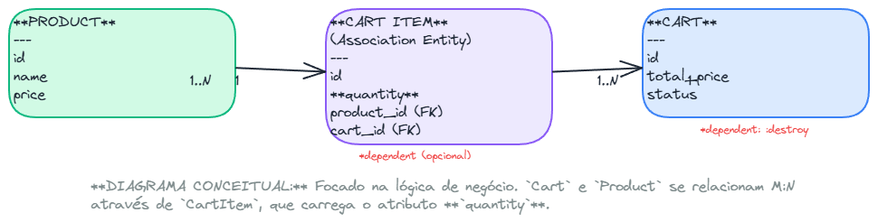
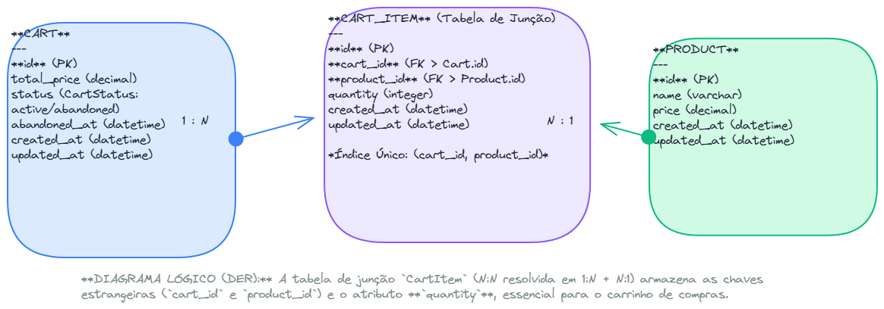

# API de Carrinho de Compras - Solução do Desafio Técnico

## Sumário
- [1. Introdução](#1-introdução)
- [2. Arquitetura e Decisões de Design](#2-arquitetura-e-decisões-de-design)
- [3. Tecnologias Utilizadas](#3-tecnologias-utilizadas)
- [4. Como Executar a Aplicação](#4-como-executar-a-aplicação)
- [5. Como Rodar os Testes](#5-como-rodar-os-testes)
- [6. Endpoints da API](#6-endpoints-da-api)
- [7. Documentação Adicional](#7-documentação-adicional)

---

## 1. Introdução


API RESTful em Ruby on Rails para gerenciamento de um carrinho de compras, desenvolvida como solução para o desafio técnico.

> Para a descrição original do desafio, veja o arquivo [docs/tech-challenge-original.md](./docs/tech-challenge-original.md).

---

## 2. Arquitetura e Decisões de Design

### Diagramas da Solução

**Diagrama Conceitual:**
*(Mostra a visão geral dos entidades e suas interações)*


**Diagrama de Lógica / Schema do Banco de Dados:**
*(Detalha a estrutura das tabelas e seus relacionamentos)*


A solução foi desenvolvida seguindo princípios de Clean Code e manutenibilidade.

- **"Fat Model, Skinny Controller"**
- **Callbacks do Active Record**
- **Gerenciamento de Estado**
- **Tratamento de Exceções Centralizado**

---

## 3. Tecnologias Utilizadas

- **Linguagem:** Ruby 3.3.1
- **Framework:** Rails 7.1.3.2
- **Banco de Dados:** PostgreSQL 16
- **Cache & Fila:** Redis 7.0.15
- **Jobs em Background:** Sidekiq 7.2.4
- **Containerização:** Docker, Docker Compose

---

## 4. Como Executar a Aplicação

### Pré-requisitos
- Docker e Docker Compose instalados.
- Para execução local: Ruby 3.3.1 e Bundler.

### Modo 1: Usando Docker Compose (Recomendado)
1.  **Configurar o Ambiente:**
    ```bash
    cp .env.docker .env
    ```
2.  **Iniciar os Serviços:**
    ```bash
    docker-compose up -d --build
    ```
3.  **Popular o Banco de Dados (Opcional):**
    ```bash
    docker-compose exec web bundle exec rails db:seed
    ```
A aplicação estará disponível em `http://localhost:3000`.

### Modo 2: Ambiente de Desenvolvimento Híbrido (Local)
1.  **Instalar Dependências:**
    ```bash
    bundle install
    ```
2.  **Configurar o Ambiente:**
    ```bash
    cp .env.local .env
    ```
3.  **Preparar o Banco de Dados:**
    ```bash
    bundle exec rails db:prepare && bundle exec rails db:seed
    ```
4.  **Iniciar a Aplicação:**
    ```bash
    ./bin/dev
    ```
A aplicação estará disponível em `http://localhost:3000`.

---

## 5. Como Rodar os Testes

### Modo 1: Dentro do Contêiner Docker (Recomendado)
- **Executar a suíte completa:**
    ```bash
    docker-compose run --rm test bundle exec rspec
    ```
- **Executar um arquivo de teste específico:**
    ```bash
    docker-compose run --rm test bundle exec rspec spec/models/cart_spec.rb
    ```

### Modo 2: Localmente
1.  **Iniciar o Banco de Dados:**
    ```bash
    docker-compose up -d db
    ```
2.  **Preparar o Banco de Teste:**
    ```bash
    bundle exec rails db:prepare RAILS_ENV=test
    ```
3.  **Executar a suíte completa:**
    ```bash
    bundle exec rspec
    ```
- **Executar um arquivo de teste específico:**
    ```bash
    bundle exec rspec spec/requests/carts_spec.rb
    ```

---

## 6. Endpoints da API

| Rota | Método | Descrição |
|---|---|---|
| `/products` | `GET` | Lista todos os produtos. |
| `/products/:id` | `GET` | Retorna um produto específico. |
| `/cart` | `POST` | Adiciona um produto ao carrinho. |
| `/cart` | `GET` | Lista os itens do carrinho atual. |
| `/cart/add_item` | `POST` | Altera quantidade de um item existente. |
| `/cart/:product_id` | `DELETE` | Remove um produto do carrinho. |

---

## 7. Documentação Adicional

### Documentação Interativa da API (Requisições HTTP)

Este repositório contém uma coleção de requisições HTTP no diretório `http/` (`products.http` e `carts.http`).

Para utilizá-los, recomenda-se a extensão [REST Client](https://marketplace.visualstudio.com/items?itemName=humao.rest-client) para o Visual Studio Code.
